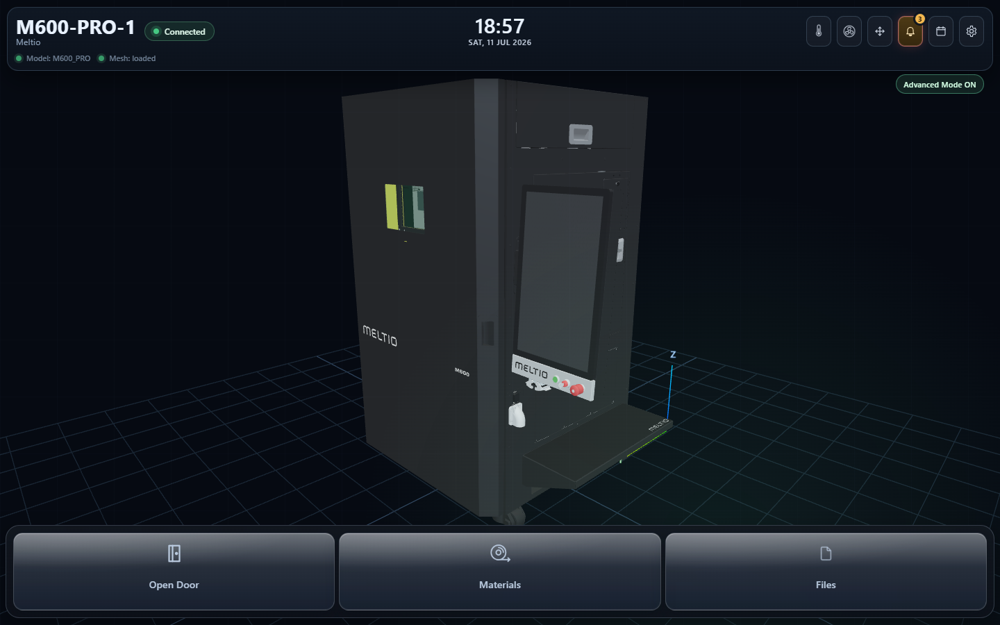

# Meltio URDF Viewer

A web-based 3D viewer for the Meltio M600-PRO metal-printing system, with an
**embedded slicer** and an **in-scene print simulation**. It renders the live
machine (URDF + meshes), lets you slice an STL, and plays the print back on the
real gantry motion — all in the browser.



---

## What's inside

The app is **two local services** that run together:

| Service | Package | Port | Runtime |
|---------|---------|------|---------|
| **Viewer** (`avisualizer`) | `urdf_viewer/projects/avisualizer` | `8090` | Python ≥ 3.10 |
| **Slicer** (`meltio-platform`) | `_slicer_branch/projects/platform` | `8765` | Python 3.11 |

The viewer embeds the slicer (via the `AVIS_SLICER_URL` environment variable) so
the Files-menu **slice** and the in-scene **Start print** flow work end to end.

**Highlights**
- Full URDF robot render with motion presets (maintenance / print / palpador).
- Files menu → slice an STL → **Start print**: homing/probe routine, 3-axis bead
  tracing, real-speed playback, pause/stop, material gate + usage tracking.
- Fullscreen embedded slicer with a bottom **dock bar** (Model / Slice / View /
  Start print).
- Tuned for a **vertical 1080×1920 HMI touch panel** (see *Display* below).

---

## Prerequisites

- **Windows 10/11**
- **Python 3.11** on the `PATH` (the `py -3.11` launcher is used below).
  3.11 satisfies both services and has prebuilt wheels for the heavy deps
  (`open3d`, `trimesh`, `scipy`, …).
- A **Chromium browser** (Microsoft Edge or Google Chrome) — the launcher opens
  the app in one. (Any browser works if you open the URL manually.)
- ~1 GB free disk for the two virtual environments.

---

## Setup (one time)

Run these from the repository root in **PowerShell**. Two isolated environments
are created — the launcher expects these exact folder names (`.venv`, `venv311`).

**1. Slicer environment (`venv311`)**
```powershell
py -3.11 -m venv venv311
.\venv311\Scripts\python.exe -m pip install --upgrade pip
Push-Location _slicer_branch
..\venv311\Scripts\python.exe -m pip install -r requirements.txt
Pop-Location
```

**2. Viewer environment (`.venv`)**
```powershell
py -3.11 -m venv .venv
.\.venv\Scripts\python.exe -m pip install --upgrade pip
Push-Location urdf_viewer
..\.venv\Scripts\python.exe -m pip install -r requirements.txt
Pop-Location
```

> The first install pulls large native wheels (`open3d`, `trimesh`, `scipy`,
> `shapely`, `rtree`) and can take several minutes.

---

## Running

### The easy way — one click
Double-click **`Start-Viewer.bat`** (or the *Meltio Viewer* desktop shortcut).
It starts both services if they aren't already running, waits until they answer,
then opens the viewer **maximized** in your browser with a fresh cache-bust.

Stop everything with **`Stop-Viewer.bat`**.

### Manual (two terminals)
```powershell
# Terminal 1 — slicer
$env:PYTHONPATH = "$PWD\_slicer_branch\projects\platform\src"
.\venv311\Scripts\python.exe -m uvicorn meltio_platform.slicer.web.app:create_app --factory --host 127.0.0.1 --port 8765

# Terminal 2 — viewer
$env:PYTHONPATH       = "$PWD\urdf_viewer\projects\avisualizer\src"
$env:AVIS_SLICER_URL  = "http://127.0.0.1:8765"
$env:AVIS_SLICER_UI_URL = "http://127.0.0.1:8765"
.\.venv\Scripts\python.exe -m uvicorn avisualizer.web.app:create_app --factory --host 127.0.0.1 --port 8090
```
Then open **http://127.0.0.1:8090/urdf**.

---

## Display — vertical 1080×1920 panel

The standard target is a **1920×1080 screen mounted vertically** (a 1080×1920
portrait viewport), e.g. an HMI touch panel. The layout, bottom navigation, and
slicer dock bar are tuned for that.

- The bottom bars sit **60 px** above the viewport edge so the Windows taskbar
  doesn't clip them when the browser isn't fullscreen.
- For a true kiosk look (taskbar hidden, no wasted space), run the browser
  fullscreen: press **F11**, or launch with `--kiosk` /
  `--app=http://127.0.0.1:8090/urdf`. (To make the launcher do this by default,
  change `--start-maximized` to `--kiosk` in `launch-viewer.ps1`.)

---

## Project layout

```
.
├─ Start-Viewer.bat        # one-click launcher (double-click this)
├─ Stop-Viewer.bat         # stops both services
├─ launch-viewer.ps1       # launcher logic (starts servers, opens browser)
├─ urdf_viewer/            # the viewer app (avisualizer)
│   └─ projects/avisualizer/
│       ├─ src/            # Python backend + web/ (static JS/CSS: the UI)
│       └─ assets/         # M600-PRO URDF + meshes (.glb/.obj)
└─ _slicer_branch/         # the slicer backend (meltio-platform)
    └─ projects/platform/
        └─ src/meltio_platform/slicer/   # slicer web app + engine
```

The virtual environments (`.venv`, `venv311`) and large local datasets are **not**
tracked — they are created by the setup steps above.

---

## Troubleshooting

- **Port already in use** — a previous instance is still running. Run
  `Stop-Viewer.bat`, then start again. The launcher is idempotent: if a service
  is already up it just opens the browser.
- **Bottom buttons cut off** — the browser isn't fullscreen and the taskbar is
  taller than the 60 px clearance. Run fullscreen (F11 / `--kiosk`), or increase
  the `bottom` value in `launch-viewer.ps1` / the CSS.
- **I don't see my CSS/JS change** — the launcher appends a `?cb=` cache-bust on
  every run; if opening the URL by hand, hard-reload (Ctrl+F5).
- **`open3d` fails to install** — make sure the environment is Python **3.11**
  (newer/older versions may lack prebuilt wheels).

---

*Internal / proprietary — Meltio. Not for public distribution.*
