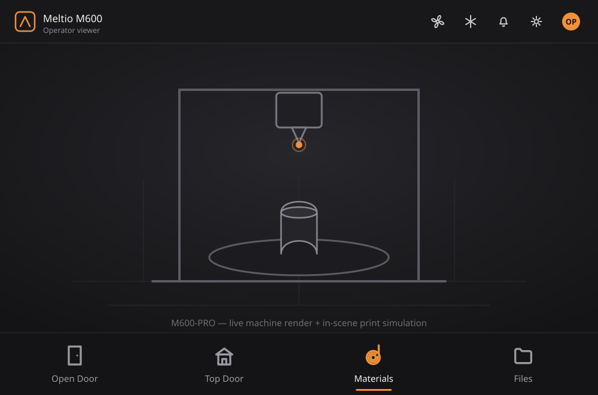

# Meltio URDF Viewer

A web-based 3D **operator HMI** for the Meltio M600-PRO metal-printing system. It
renders the live machine (URDF + meshes), drives the machine and its peripherals
through a touch-first control surface, embeds a **slicer**, and plays a slice back
as an **in-scene print simulation** on the real gantry motion — all in the browser.



> The overview above is a schematic of the current UI. A live capture of the 3D
> scene is in [`docs/screenshot-viewer.png`](docs/screenshot-viewer.png).

---

## What's inside

The app is **two local services** that run together:

| Service | Package | Port | Runtime |
|---------|---------|------|---------|
| **Viewer** (`avisualizer`) | `urdf_viewer/projects/avisualizer` | `8090` | Python ≥ 3.10 |
| **Slicer** (`meltio-platform`) | `_slicer_branch/projects/platform` | `8765` | Python 3.11 |

The viewer embeds the slicer (via the `AVIS_SLICER_URL` environment variable) so
the Files-menu **slice** and the in-scene **Start print** flow work end to end.
The front-end is a single-page **vanilla-JS + Three.js** app (no build step) served
from `urdf_viewer/…/web/static/`; the Python side is a small FastAPI backend
(auth, permissions, error codes, slicer proxy, machine-link transport).

---

## Operator interface

Everything is tuned for a **vertical 1080×1920 HMI touch panel**, with a full-bleed
top bar and bottom navigation.

**3D scene** — full URDF render of the M600-PRO with procedural image-based
lighting, framed resting/overview cameras, and motion presets (maintenance /
print / palpador). Optional chiller (HRS050) model toggles in beside the machine.

**Top bar (right)** — flat, frameless utility controls, each tinting accent when
active:
- **Fan** and **Chiller** — tap to toggle; long-press / double-tap opens a settings
  popover (fan speed & mode, chiller target/current).
- **Notifications** — a bell with a live count badge; opens the notification centre
  (raised/solved machine events from the error-code catalog) with a dated,
  persisted **history** view. New critical/warning events also arrive as toasts.
- **Settings** and an **account chip** showing the signed-in user's initials.

**Bottom navigation** — icon-forward tabs whose glyphs reflect their action:
- **Open Door** / **Top Door** — the door/roof icons animate open on the real
  machine state (the door swings from the right; the top-cover "house" roof lifts
  with rise-arrows).
- **Materials** — per-feeder loading (Feeder 1 / 2, spool or drum feed), load /
  unload and amount loaded; the spool icon spins and pays out filament when open.
- **Files** — browse & slice STLs, then **Start print** to dock the job.
- During a docked print the bar becomes **Stop / Pause / Slicer**.

**Controls · Move** — an operator jog panel (permission-gated): X/Y/Z jog with a
constant-velocity glide (no snapping), **Home XY** and **Home Z**, and a smooth
**palpador** deploy/retract toggle.

**Accounts & permissions** — credential sign-in (username + password) via
`POST /api/auth/login`, validated against per-user PBKDF2 credentials stored
inside the roles/users document (`database/permissions.json`, passwords managed
with `urdf_viewer/projects/avisualizer/tools/set_password.py`). Sign-in resolves a
permission level (Operator, Operator+, Support, God); motion-bearing controls
(the Move panel, machine commands) are gated to the appropriate level, and the
session auto-signs-out when idle. The gating is a UI convenience, not a security
boundary — a real machine must enforce authorization for physical commands.

**Print flow** — Files → slice an STL → **Start print**: pre-print homing/probe
routine, 3-axis bead tracing at real speed, pause/stop, plus a material gate and
usage tracking. A docked **Slicer** panel and a fullscreen embedded slicer share
one palette.

---

## Prerequisites

- **Windows 10/11**
- **Git LFS** (`git lfs install`) — the GLB meshes are LFS objects; without it a
  clone gets text pointers and the 3D scene loads nothing.
- **Long paths enabled** — the slicer tree exceeds Windows' 260-char `MAX_PATH`
  in deep folders; a plain `git clone` fails with "Filename too long". Run
  `git config --global core.longpaths true` once (or clone with
  `git clone -c core.longpaths=true …`).
- **Python 3.11** on the `PATH` (the `py -3.11` launcher is used below).
  3.11 satisfies both services and has prebuilt wheels for the heavy deps
  (`open3d`, `trimesh`, `scipy`, …).
- A **Chromium browser** (Microsoft Edge or Google Chrome) — the launcher opens
  the app in one. (Any browser works if you open the URL manually.)
- ~1 GB free disk for the two virtual environments.

---

## Setup (one time)

Run these from the repository root in **PowerShell**. Two isolated environments
are created — the launcher expects these exact folder names (`.venv`, `venv311`).

**1. Slicer environment (`venv311`)**
```powershell
py -3.11 -m venv venv311
.\venv311\Scripts\python.exe -m pip install --upgrade pip
Push-Location _slicer_branch
..\venv311\Scripts\python.exe -m pip install -r requirements.txt
Pop-Location
```

**2. Viewer environment (`.venv`)**
```powershell
py -3.11 -m venv .venv
.\.venv\Scripts\python.exe -m pip install --upgrade pip
Push-Location urdf_viewer
..\.venv\Scripts\python.exe -m pip install -r requirements.txt
Pop-Location
```

> The first install pulls large native wheels (`open3d`, `trimesh`, `scipy`,
> `shapely`, `rtree`) and can take several minutes.

---

## Running

### The easy way — one click
Double-click **`Start-Viewer.bat`** (or the *Meltio Viewer* desktop shortcut).
It starts both services if they aren't already running, waits until they answer,
then opens the viewer **maximized** in your browser with a fresh cache-bust.

Stop everything with **`Stop-Viewer.bat`**.

### Manual (two terminals)
```powershell
# Terminal 1 — slicer
$env:PYTHONPATH = "$PWD\_slicer_branch\projects\platform\src"
.\venv311\Scripts\python.exe -m uvicorn meltio_platform.slicer.web.app:create_app --factory --host 127.0.0.1 --port 8765

# Terminal 2 — viewer
$env:PYTHONPATH       = "$PWD\urdf_viewer\projects\avisualizer\src"
$env:AVIS_SLICER_URL  = "http://127.0.0.1:8765"
$env:AVIS_SLICER_UI_URL = "http://127.0.0.1:8765"
.\.venv\Scripts\python.exe -m uvicorn avisualizer.web.app:create_app --factory --host 127.0.0.1 --port 8090
```
Then open **http://127.0.0.1:8090/urdf**.

> **Machine link** — the live-machine transport is **off by default**; append
> `?machine=1` to the URL to enable it (otherwise the scene runs against the mock
> machine state).

---

## Display — vertical 1080×1920 panel

The standard target is a **1920×1080 screen mounted vertically** (a 1080×1920
portrait viewport), e.g. an HMI touch panel. The layout, bottom navigation, and
slicer dock bar are tuned for that.

- The top and bottom bars span the full width of the frame (edge-to-edge).
- For a true kiosk look (taskbar hidden, no wasted space), run the browser
  fullscreen: press **F11**, or launch with `--kiosk` /
  `--app=http://127.0.0.1:8090/urdf`. (To make the launcher do this by default,
  change `--start-maximized` to `--kiosk` in `launch-viewer.ps1`.)

---

## Project layout

```
.
├─ Start-Viewer.bat        # one-click launcher (double-click this)
├─ Stop-Viewer.bat         # stops both services
├─ launch-viewer.ps1       # launcher logic (starts servers, opens browser)
├─ docs/                   # README assets (ui-overview.svg, screenshot-viewer.png)
├─ urdf_viewer/            # the viewer app (avisualizer)
│   └─ projects/avisualizer/
│       ├─ src/            # FastAPI backend + web/ (static JS/CSS: the UI)
│       └─ assets/         # M600-PRO URDF + meshes (.glb/.obj)
└─ _slicer_branch/         # the slicer backend (meltio-platform)
    └─ projects/platform/
        └─ src/meltio_platform/
            ├─ slicer/     # slicer web app + engine — this is what runs locally
            └─ web/        # multi-tenant cloud shell (Postgres/S3/admin) — DORMANT
```

> The local HMI launches only `meltio_platform.slicer.web.app`. The rest of
> `meltio_platform` (the `web/` cloud shell, plus the `frontend/` React SPA and
> `render-service/`) is a separate cloud product that is **not started** by the
> launcher; ignore it unless you are working on that deployment.

The virtual environments (`.venv`, `venv311`) and large local datasets are **not**
tracked — they are created by the setup steps above.

---

## Troubleshooting

- **Port already in use** — a previous instance is still running. Run
  `Stop-Viewer.bat`, then start again. The launcher is idempotent: if a service
  is already up it just opens the browser.
- **Bottom buttons cut off** — the browser isn't fullscreen and the taskbar
  overlaps the bar. Run fullscreen (F11 / `--kiosk`).
- **I don't see my CSS/JS change** — the static assets are cache-busted with a
  `?v=` query on every UI change; the launcher also appends a `?cb=` on the URL.
  If opening the URL by hand, hard-reload (Ctrl+F5).
- **`open3d` fails to install** — make sure the environment is Python **3.11**
  (newer/older versions may lack prebuilt wheels).

---

*Internal / proprietary — Meltio. Not for public distribution.*
